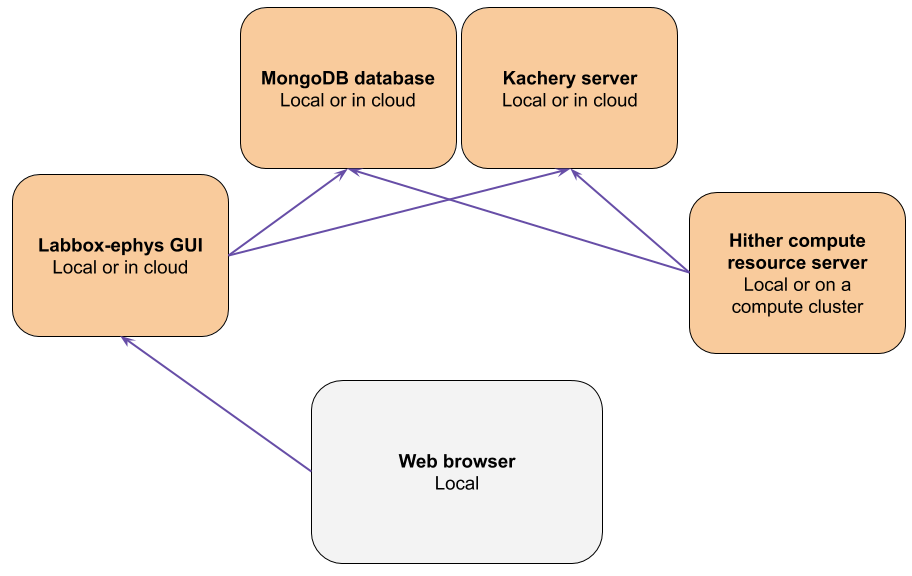

# Host a hither compute resource locally

**Important: these instructions are obsolete**

These instructions show how to host a hither compute resource on your local computer. This can be used to run spike sorting when launched from the labbox-ephys GUI.

The easiest way to do this is to use the instructions in the labbox-ephys GUI, on the Config page. That will point you to using the `labbox-launcher config-compute-resource` utility

## Some more details

**Important: these instructions are obsolete**

To host a compute resource server, you must have three services running.

* A mongo database (either in the cloud or on your local machine)
* A kachery server (either locally or remotely)
* A hither compute resource server (either locally or remotely)

